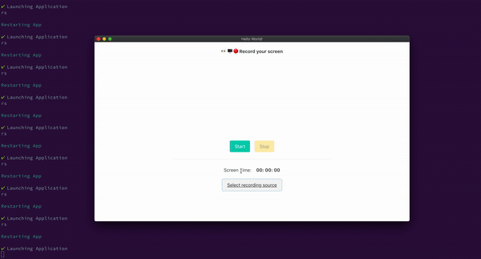

## A Cross-platform screen recorder project using ElectronJS

This project is initialised using Electron forge 
https://www.electronforge.io/. Follow the steps in the electron forge documentation to create a fresh project.

### Steps to be create a new project

- <code>npx create-electron-app <b>your-app</b></code>
- <code>cd <b>your-app</b></code>
- <code>npm start</code>

### Steps to run this project

- <code>git clone https://github.com/dineshnadimpalli/ScreenRecorder_App.git</code>
- <code>cd ScreenRecorder_App</code>
- <code>npm install</code>
- <code>npm start</code>

    

